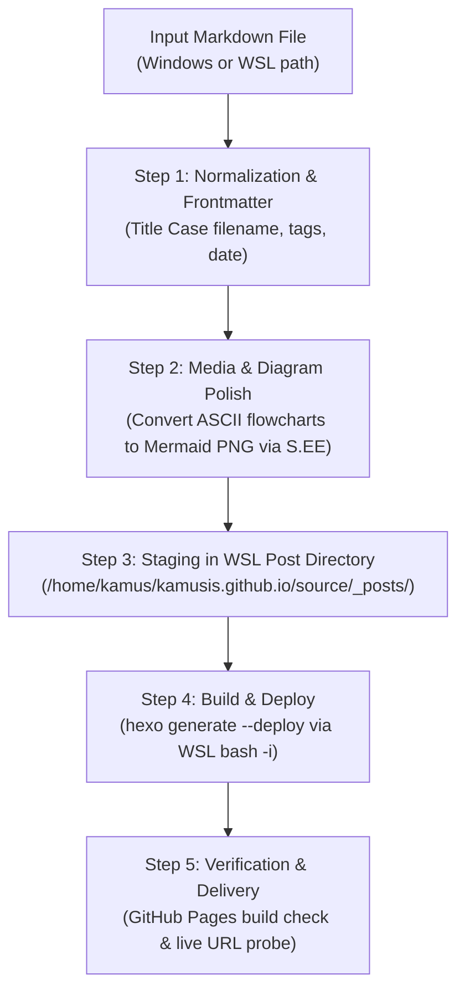

# Hexo Blog Publishing Orchestrator (`hexo-blog-publish`)

Automates the complete publishing pipeline for technical articles and Markdown posts to **`kamusis.me`** (hosted on GitHub Pages via Hexo inside WSL Ubuntu 24.04).

---

## 🏗️ Architecture & Core Components



### Key Paths and Constants
- **WSL Blog Directory**: `/home/kamus/kamusis.github.io/`
- **Windows UNC Path**: `\\wsl.localhost\Ubuntu-24.04\home\kamus\kamusis.github.io\`
- **Posts Directory**: `/home/kamus/kamusis.github.io/source/_posts/`
- **Site URL**: `https://www.kamusis.me`
- **GitHub Repository**: `kamusis/kamusis.github.io` (branch `master`)
- **Deployment Script**: `/home/kamus/kamusis.github.io/d.sh` (`hexo generate --deploy`)
- **Shell Environment**: NVM Node.js `v24.14.0` in `/home/kamus/.nvm/versions/node/v24.14.0/bin/hexo`. **Always execute with `bash -i -c` or `npx hexo`** to ensure NVM PATH is loaded in non-interactive sessions.

---

## 📋 5-Step Publishing Pipeline

### Step 1: Input Parsing & Frontmatter Normalization

1. **Filename Convention**:
   - Must strictly match `kamusis.me` historical habits: **Title Case with hyphens** separating words.
   - Example format: `Configuring-Claude-Code-and-Claude-Desktop-to-Use-Gemini-via-Antigravity-Manager.md`
   - Target path: `\\wsl.localhost\Ubuntu-24.04\home\kamus\kamusis.github.io\source\_posts\<Title-Case-Name>.md`

2. **Frontmatter Specification**:
   Ensure the Markdown file starts with valid YAML frontmatter:
   ```yaml
   ---
   title: 'Your Article Title in Clean Title Case'
   date: YYYY-MM-DD HH:MM:SS
   tags: [Tag1, Tag2, Tag3]
   ---
   ```
   - `date`: Use current local time (`YYYY-MM-DD HH:MM:SS`).
   - `tags`: 3–8 concise, capitalized technical tags (e.g., `[Claude, Gemini, Antigravity, LLM, Proxy, Windows, macOS]`).

3. **Language & Translations**:
   - If the user explicitly asks for English, translate the document to professional, technically precise English before publishing.
   - Ensure all code symbols, paths, and identifiers remain literal.

---

### Step 2: Diagram & Image Optimization

Raw ASCII text boxes and character art often render poorly or misaligned in web browsers.

1. **ASCII Flowcharts to Mermaid**:
   - When encountering text-based box diagrams, convert them into structured Mermaid flowchart code (`flowchart TD`).
   - Keep node labels concise with `<br/>` breaks to ensure balanced box padding.

2. **Render to PNG & Upload to S.EE**:
   - Render Mermaid to PNG using the `mermaid-viz` tool:
     ```powershell
     Get-Content "diag.mmd" -Raw | node "C:\Users\kamus\.gemini\config\skills\mermaid-viz\scripts\mermaid-viz.js" --type png --theme github-light --output "output.png"
     ```
   - Upload PNG to S.EE via `see-uploader`:
     ```powershell
     python "C:\Users\kamus\.gemini\config\skills\see-uploader\scripts\upload.py" --file "output.png"
     ```
   - Replace the ASCII block in the Markdown with the resulting image embed:
     ```markdown
     
     ```

---

### Step 3: Stage in WSL Hexo Repository

Write or copy the prepared Markdown file directly into WSL:
```powershell
# Windows PowerShell example
Copy-Item "C:\path\to\your-article.md" "\\wsl.localhost\Ubuntu-24.04\home\kamus\kamusis.github.io\source\_posts\<Filename>.md" -Force
```
Or use `write_to_file` targeting `\\wsl.localhost\Ubuntu-24.04\home\kamus\kamusis.github.io\source\_posts\<Filename>.md`.

---

### Step 4: Build & Deploy via WSL

Execute Hexo generation and deployment within WSL Ubuntu 24.04.

> [!IMPORTANT]
> **Environment Guard**: Because non-interactive `bash -c` does not source `.bashrc` NVM paths, you MUST either use `bash -i -c` (interactive shell) or call `npx hexo`.

Run deployment:
```bash
wsl.exe -d Ubuntu-24.04 -- bash -i -c "cd /home/kamus/kamusis.github.io && hexo generate --deploy"
```
*Fallback if alias or path fails*:
```bash
wsl.exe -d Ubuntu-24.04 -- bash -c "cd /home/kamus/kamusis.github.io && npx hexo generate --deploy"
```

Verify that the output reports:
`INFO Deploy done: git`

---

### Step 5: Verify Deployment & Live Post

1. **Monitor GitHub Pages Build Status**:
   ```bash
   wsl.exe -d Ubuntu-24.04 -- bash -c "gh api repos/kamusis/kamusis.github.io/pages/builds/latest --jq '{status: .status, commit: .commit}'"
   ```
   Wait until `status` transitions from `"building"` to `"built"` (typically takes 15–30 seconds).

2. **Verify Live URL & Homepage**:
   - Construct live post URL from frontmatter date and filename:
     `https://www.kamusis.me/YYYY/MM/DD/<Filename-Without-Extension>/`
   - Probe URL:
     ```powershell
     curl.exe -s -I "https://www.kamusis.me/YYYY/MM/DD/<Slug>/"
     ```
     Ensure it returns `HTTP/1.1 200 OK`.
   - Verify that the article appears on the homepage (`https://www.kamusis.me/`).

---

## 🚀 Usage Examples

### Trigger Phrase 1: "用 hexo-blog-publish 技能把这篇文章发布出去"
1. Read the target `.md` file.
2. Verify title, tags, date, and diagram rendering.
3. Save to `/home/kamus/kamusis.github.io/source/_posts/<Title-Case-Name>.md`.
4. Deploy via `bash -i -c "hexo g -d"`.
5. Check GitHub Pages build status and report the live URL.

### Trigger Phrase 2: "把这篇文章翻译成英文并发布到 kamusis.me"
1. Translate content into high-quality technical English.
2. Format filename with Title-Case-With-Hyphens.
3. Optimize diagrams to S.EE image links.
4. Stage and deploy in Hexo.
5. Report live link.
