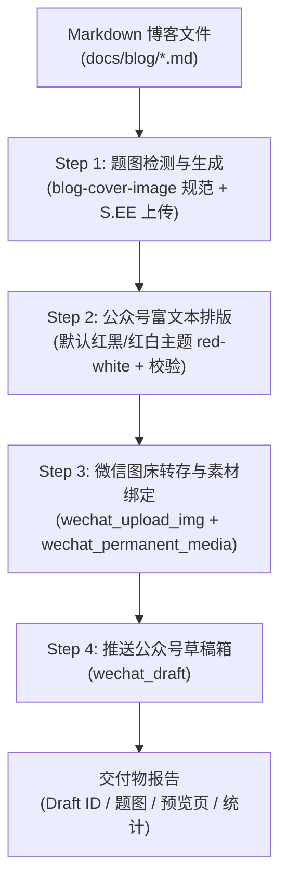

# Mopheus Blog Publishing Orchestrator (mopheus-blog-publish)

把一篇由 `mopheus-feature-blog` 撰写的 Markdown 技术博客（或任意 `.md` 稿件），通过统一编排流水线**一步全自动**完成：
1. **题图设计与生成**（暖调复古插画风格，自动上传 S.EE 图床并回写 Markdown）；
2. **公众号富文本排版**（**默认采用经典红黑/红白主题 `red-white`**、3 阶视觉层级、关键词下划线、章节编号、合规校验）；
3. **防盗链素材转存与封面绑定**（正文图片转存微信 CDN，题图登记为永久素材）；
4. **公众号草稿箱一键推送**（调用微信官方 Draft API 并在后台生成草稿）。

---

## 🏗️ 架构与依赖关系

本技能作为**总控编排器（Orchestrator）**，复用并串联以下原子技能与工具链：



- **图像生成与图床**：`generate_image` (nano-banana-pro) + `C:\Users\kamus\.gemini\config\skills\see-uploader\scripts\upload.py`
- **排版引擎与组件库**：`C:\Users\kamus\.gemini\config\skills\gzh-design`（核心组件库：`references/theme-red-white.md`）
- **微信 API MCP 工具**：`wechat-official-account-mcp` (`wechat_upload_img`, `wechat_permanent_media`, `wechat_draft`)

---

## 📋 4 步全自动流水线 (Pipeline)

### Step 0: 定位输入源与元数据提取

从用户提供的 Markdown 文件（例如 `docs/blog/how-mopheus-designs-sit-integration-testing.md`）中提取以下关键字段：

| 字段 | 提取规则 | 约束与转换 |
| :--- | :--- | :--- |
| **文件路径** | 默认为用户指定路径或 `docs/blog/*.md` | 必须为有效存在的 `.md` 文件 |
| **标题 (`title`)** | 提取一级标题 `# 标题` 或 Frontmatter `title` | 长度必须 $\le 64$ 字符（超长需精简） |
| **作者 (`author`)** | 提取 Frontmatter `author`（默认 `Mopheus` 或 `Kamus`） | 长度必须 $\le 8$ 汉字 / $16$ 英文字符（微信硬性限制） |
| **摘要 (`digest`)** | 提取 Frontmatter `summary`/`description` 或开头引言段落 | 长度必须 $\le 120$ 字符 |
| **已有封面图** | 检查标题下方是否已有 `` | 若已有有效 S.EE 图床直链，直接复用 |

---

### Step 1: 题图检测与自动生成 (`blog-cover-image`)

1. **检查封面状态**：
   - 若文章第一段/H1 下方已有公开图床题图（且用户未显式要求“重新生成封面”），直接进入 Step 2；
   - 若无题图，则进入全自动生成流程。

2. **构建 Prompt（遵循 `blog-cover-image` 暖调童话插画/vintage wonder 规范）**：
   ```text
   A whimsical, highly detailed storybook illustration for a technical blog post titled "<TITLE>".
   Hand-drawn feel, rich textures, soft warm lighting, intricate background.
   Vintage wonder aesthetic. Blend the technical theme (<METAPHOR_BASED_ON_CONTENT>) with imaginative, cozy elements (e.g., small clever animals or charming clockwork robots operating vintage computing consoles, glowing conduits, mechanical switchboards).
   Avoid generic neon sci-fi. 16:9 aspect ratio.
   ```

3. **生成与上传**：
   - 调用 `generate_image` 工具（`AspectRatio: "16:9"`，`ImageName` 为文章 slug 风格命名）；
   - 执行上传脚本将生成的本地图片上传至 S.EE 图床：
     ```bash
     python C:\Users\kamus\.gemini\config\skills\see-uploader\scripts\upload.py --file <生成的图片路径>
     ```
   - 提取返回的公开直链 `https://files.seeusercontent.com/...`；
   - **回写 Markdown 文件**：在文章 H1 `# Title`（或开头引言块）正下方插入题图：
     ```markdown
     
     ```

---

### Step 2: 自动公众号富文本排版 (`gzh-design`)

1. **默认排版主题：红白色系 / 红黑主题 (`red-white`)**：
   - **默认强制首选**：**红白色系 (`references/theme-red-white.md` / `red-white`)**；
   - **视觉特征**：
     - **主色调**：`#DC2626`（正红点睛，用于锚点、重点高亮徽标与左竖条）；
     - **标题色**：`#1C1917`（近黑/碳黑，结构醒目，力量感强）；
     - **正文色**：`#374151`（深灰，可读性极高）；
     - **下划线**：`border-bottom: 2px solid #FECACA; font-weight: 600;`（珊瑚粉淡标记，不刺眼但突出重点）；
   - 除非用户在指令中明确要求切换到其他主题（如 `moyu-green` / `olive-journal`），否则**一律默认采用 `red-white` 主题**。

2. **执行核心排版规则**（依据 `gzh-design` & `theme-red-white.md`）：
   - **3 阶视觉层级**：锚点层（正红主色加粗 $\le 5$ 处）、标记层（段落核心关键词粉色下划线高频）、容器层（浅底引用块/灰底卡片）；
   - **章节自动编号**：`##` 依序映射 `01/02/03...`；
   - **标点与格式全角化**：正文标点一律替换为全角中文标点（弯引号 `“”`，逗号 `，`），代码块/URL 内保持半角；
   - **代码块行上方注释**：禁止行尾空格对齐中文注释，全部改为标准行上注释；
   - **ASCII 框图自适应化**：严禁把带制表符的 ASCII 架构图塞进代码块，自动转换为主题 Flexbox 卡片流或红黑边框结构盒；
   - **尾部唯一签名与 CTA**：文章末尾保留唯一的 Mopheus 引导 CTA 卡片，不得多处重复。

3. **生成与校验**：
   - 生成纯净正文 HTML：`{原文件名}_排版_红白色系(red-white).html`；
   - 生成带复制按钮的预览页：`wrap_preview.py`；
   - **强制执行校验脚本**：
     ```bash
     python C:\Users\kamus\.gemini\config\skills\gzh-design\scripts\validate_gzh_html.py <纯净正文HTML路径>
     ```
     确保 0 ERROR 与 0 半角标点 WARNING。

---

### Step 3: 微信图床转存、封面注册与草稿发布 (`gzh-publish`)

1. **正文图片扫描与转存 (`wechat_upload_img`)**：
   - 提取 HTML 中所有 `` 地址；
   - 远程外链（如 S.EE 或 GitHub 图床）自动下载到本地临时目录 `scratch/wechat_images/`；
   - 针对每张本地图片调用 MCP 工具 `wechat_upload_img`（`action: "upload", file_path: "..."`）；
   - 将 HTML 中原始 `src="..."` 精确替换为微信返回的官方 CDN 地址（`http://mmbiz.qpic.cn/...`），彻底解决防盗链空白问题。

2. **上传封面图注册永久素材 (`wechat_permanent_media`)**：
   - 取 Step 1 中生成的封面图本地文件；
   - 调用 MCP 工具 `wechat_permanent_media`（`action: "add", type: "image", file_path: "..."`）；
   - 获取微信返回的永久 `media_id`（作为草稿的 `thumb_media_id`）。

3. **创建草稿 (`wechat_draft`)**：
   - 组装草稿 Payload 并调用 MCP 工具 `wechat_draft`：
     ```json
     {
       "action": "add",
       "articles": [
         {
           "title": "<TITLE_UNDER_64_CHARS>",
           "author": "<AUTHOR_UNDER_8_CHARS>",
           "digest": "<DIGEST_UNDER_120_CHARS>",
           "content": "<SECTION_CONTENT_WITH_MMBIZ_IMAGES>",
           "thumb_media_id": "<PERMANENT_COVER_MEDIA_ID>",
           "need_open_comment": 1,
           "only_fans_can_comment": 0
         }
       ]
     }
     ```
   - 获取并记录微信返回的草稿 `media_id`。

---

### Step 4: 交付大屏与报告

发布成功后，向用户输出结构化交付面板：

```markdown
### 🎉 Mopheus 博客全链路发布成功

| 属性 | 内容 |
| :--- | :--- |
| **微信草稿 Media ID** | `ABC123xyz_draft_media_id` |
| **文章标题** | Mopheus Runtime 深度剖析：从单兵 CLI 到企业运行时 |
| **作者署名** | Mopheus (或 Kamus) |
| **文章摘要** | 如何通过 Adapter 抽象、零配置探测、标签调度与多层资源守卫... |
| **排版主题** | 红白色系 (`red-white`) |
| **题图直链** | `https://files.seeusercontent.com/...` |
| **转存图片数量** | 5 张（全部成功替换为微信 mmbiz CDN） |
| **本地交付物** | 1. 干净正文：`docs/blog/xxx_排版_红白色系(red-white).html`<br>2. 预览文件：`docs/blog/xxx_排版_红白色系(red-white)_预览.html` |

> 💡 **后续操作**：可登录 [微信公众平台 (mp.weixin.qq.com)](https://mp.weixin.qq.com) ➔ 「内容与互动」 ➔ 「草稿箱」中进行终审、群发或手机端预览。
```

---

## ⚠️ 避坑与防御铁律 (Gotchas)

1. **微信接口限制与边界防御**：
   - `title` $\le 64$ 字符；
   - `author` $\le 8$ 汉字（或 16 英文半角字符，超长时必须安全截断为 `Mopheus` 或 `Mopheus团队`）；
   - `digest` $\le 120$ 字符。
2. **正文 HTML 格式严格约束**：
   - 推送微信的内容**必须是纯 `<section>` 片段**，严禁包含 `<!DOCTYPE>`、`<html>`、`<head>`、`<body>` 或 `<script>`。
3. **图床双重防护**：
   - Markdown 原文内部必须全部使用公开 S.EE 图床直链（便于 GitHub / 外部站点阅读）；
   - 推送给微信的 HTML 内部必须全部替换为 `mmbiz.qpic.cn`（防微信端防盗链拦截）；
   - 封面图必须通过 `wechat_permanent_media` 上传获得 `thumb_media_id`，不可只传 URL。
4. **幂等性与文件保护**：
   - 题图生成后自动写回源 Markdown，避免每次运行重复生成导致封面不一致；
   - 保持原始 Markdown 结构与代码逻辑 100% 保真，排版仅做呈现增强，不篡改技术参数或代码语义。
